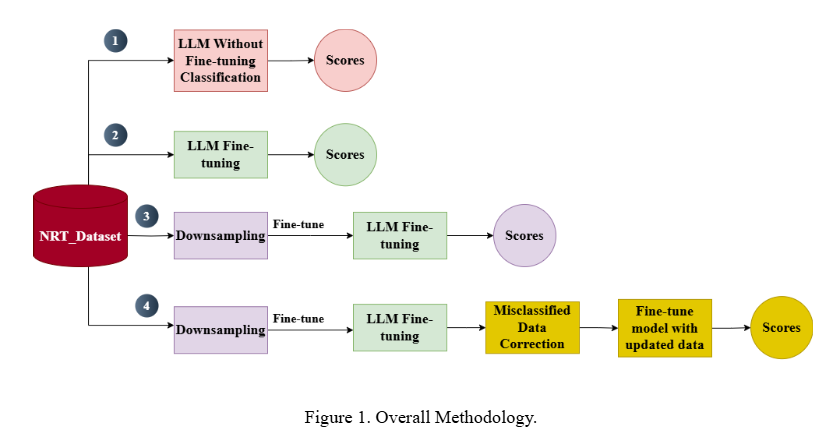

# Enhancing-Intent-Detection-in-NRT-Tweets-Using-LLM




## 🧠 Overview

Although smoking cessation aids like Nicotine Replacement Therapy (NRT) are available, quit rates remain low — in part due to the improper use of these aids. Online support groups can increase accessibility, but delivering consistent and timely responses is labor-intensive.

This project explores the development of an AI-powered intent detection system for NRT-related online communities using Large Language Models (LLMs). The goal is to accurately identify user intentions to provide responsive, context-aware support.

---

## 🎯 Objective

To build a responsive and attentive AI listener that can:

- Understand nuanced and diverse user intents in online NRT support forums.
- Address the challenges of **data imbalance** and **complexity in multiple intent classes**.
- Deliver **timely and appropriate** support responses by detecting user intent with high accuracy.

---

## 🛠️ Methods

The proposed methodology consists of **four progressive stages**:

1. **Zero-Shot Inference:**
   - Use a pre-trained LLM without fine-tuning on the dataset.
   
2. **Domain-Specific Fine-Tuning:**
   - Fine-tune the LLM on a nicotine replacement therapy (NRT) dataset.
   
3. **Class Imbalance Handling:**
   - Apply **downsampling** to the majority class and re-fine-tune the model.
   
4. **Error Correction + Fine-Tuning:**
   - Identify and fix misclassified samples.
   - Re-fine-tune the model on the corrected, downsampled dataset.

Each step addresses limitations of the previous one and contributes to incremental improvements in classification performance.

---

## 📊 Results

By combining:

- **Downsampling of the majority class**
- **Domain-specific fine-tuning**
- **Targeted error correction**

The final model achieved:

- **Unweighted F1-Score:** 86%
- **Weighted F1-Score:** 90%

These results represent:

- 📈 **28% improvement** in unweighted F1-Score
- 📈 **7% improvement** in weighted F1-Score

compared to earlier setups.

---

## 🧾 Conclusion

- LLMs **without domain-specific fine-tuning** perform poorly on intent detection in the NRT context.
- **Data imbalance** negatively affects performance, even with fine-tuning.
- **Downsampling** helps mitigate this issue but may introduce noise.
- **Manual correction of misclassified examples**, followed by fine-tuning, leads to **significant gains** in performance.

---

## 💡 Key Takeaways

- Accurate intent detection is **crucial** for responsive support in smoking cessation communities.
- A **stepwise refinement** approach leveraging LLMs can effectively handle class imbalance and language complexity.
- Combining **machine learning with human insight** (through error correction) produces the best results.

---

## 📁 Repository Structure

```bash

Enhancing-Intent-Detection-in-NRT-Tweets-Using-LLM
├── 📁 all_Data+LLM Finetune
│ ├── Final_Data_Processing-all-data.ipynb – Preprocessing on all available data
│ ├── finetune.py – Fine-tuning the LLM on the full dataset
│ └── output_log.log – Log file for model training and evaluation
│
├── 📁 data_downsample + error correction + LLM Finetune
│ ├── finetune.py – Fine-tuning after downsampling and correcting label errors
│ └── output_train.log – Log for final fine-tuning stage
│
├── 📁 data_downsample_version+ LLM Finetune
│ ├── Final_Data_Processing.ipynb – Preprocessing with downsampled data
│ ├── finetune.py – Fine-tuning on downsampled data
│ └── output_log.log – Log of training
│
└── 📁 zeroShot
├── Final_Data_Processing.ipynb – Input preparation for zero-shot predictions
├── predictions_by_llm.py – Zero-shot predictions using base LLM
└── Scores.ipynb – Evaluation and score computation

```

---

### 🧾 Explanation

- **`all_Data+LLM Finetune/`**: This folder contains scripts and logs for fine-tuning the LLM on the complete dataset without handling imbalance.
- **`data_downsample_version+ LLM Finetune/`**: This folder introduces downsampling of the majority class before training the LLM.
- **`data_downsample + error correction + LLM Finetune/`**: Final stage where data was cleaned, errors corrected, and then used for fine-tuning. This achieved the best results.
- **`zeroShot/`**: Used to test the zero-shot performance of a pre-trained LLM without any fine-tuning, providing a baseline for comparison.

---
